# dingdong

#### 介绍
dingdong(叮咚客服)是一款在线的是实时的网页咨询系统，他类似于`美洽`、`合从` 等第三方网页客服系统，有力的帮助商城系统、
法务系统、聚合服务平台、教培系统等需要在线咨询的网站。同时还可以帮助更多的程序小白从此项目中汲取经验，应用在OA系统等需要沟通的内部系统中，了解websocket通信
从而提升自己的竞争力。

#### 软件架构
thinkphp6.1 + vue2 + elementui + phpsocket.io

#### 官方交流群
QQ: **648276901**  

如果您需要多商户版本可以查看 : https://dingdong.pfecms.com

#### 安装教程
安装手册： https://da19lg68p6.feishu.cn/docs/doccnQptUuuZJm1xb5z5bgFa3Db

#### 一睹为快
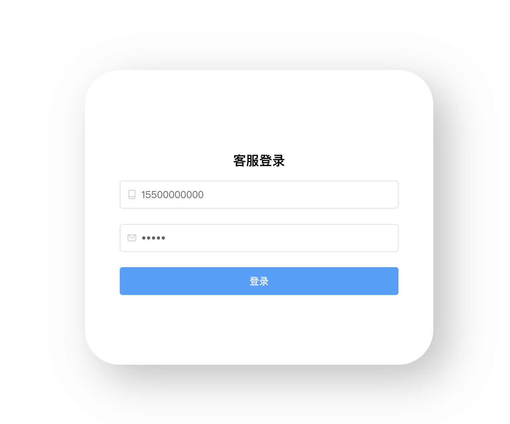

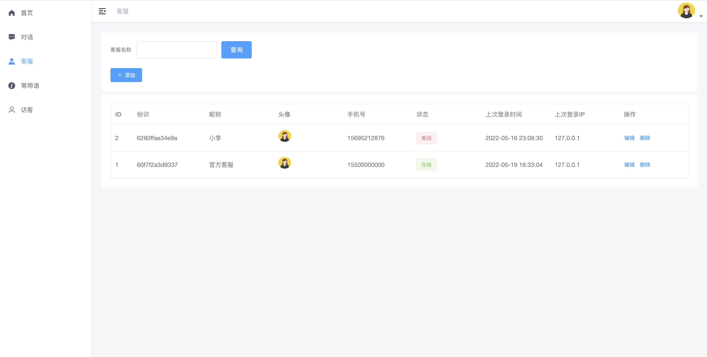

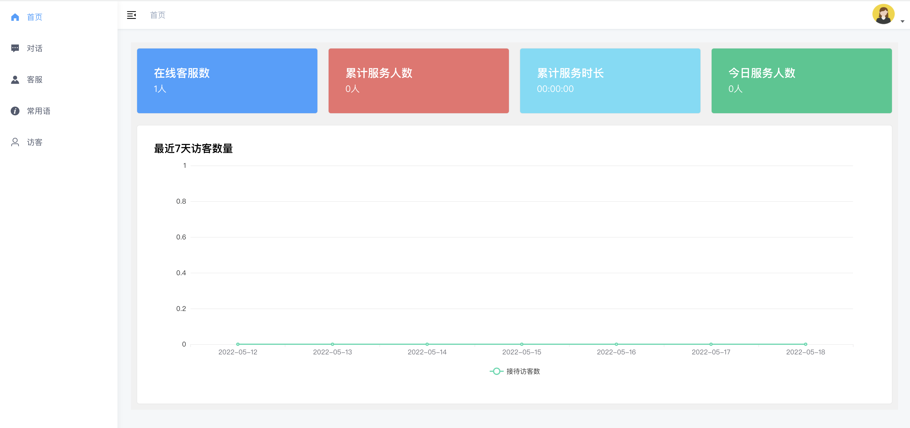

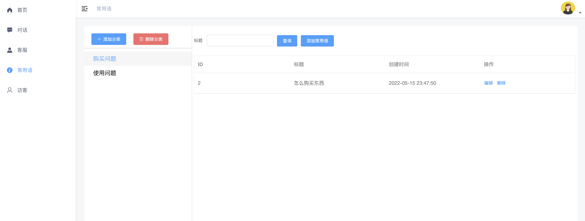

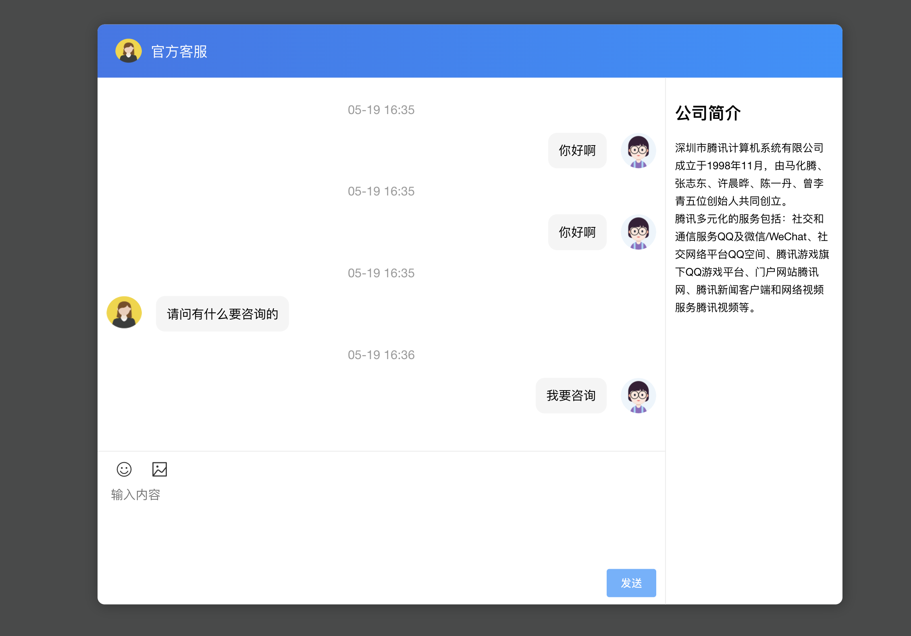

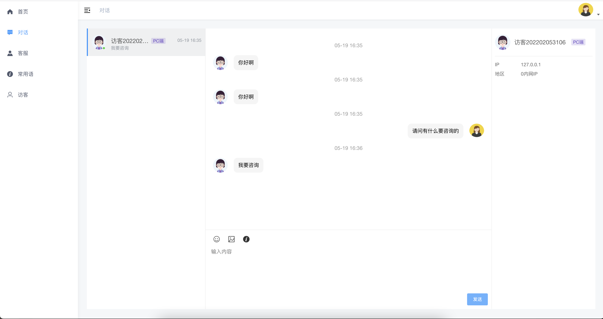

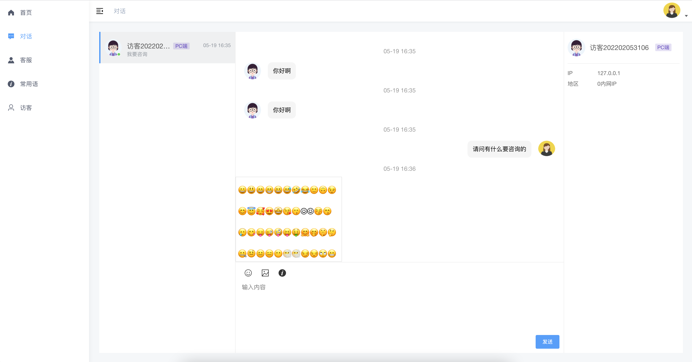

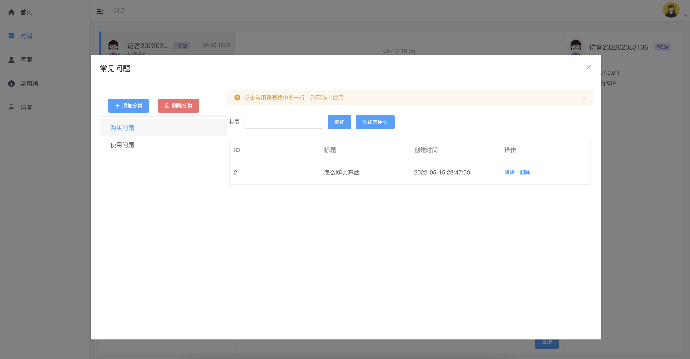

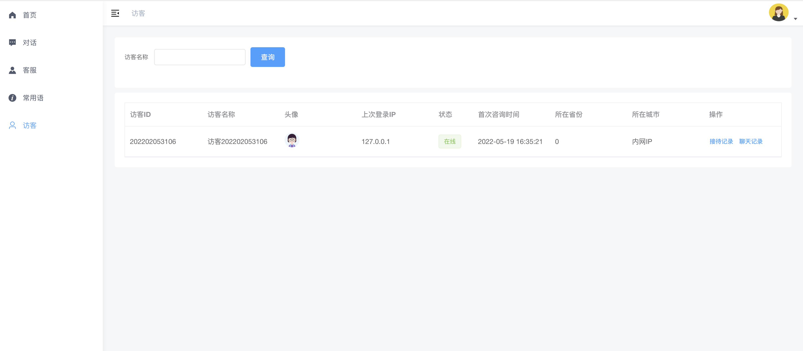

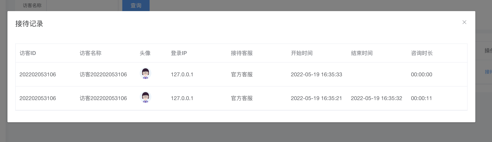

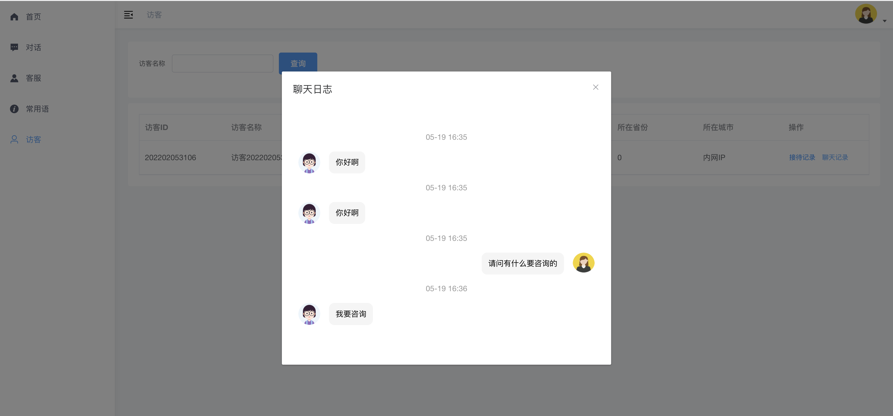

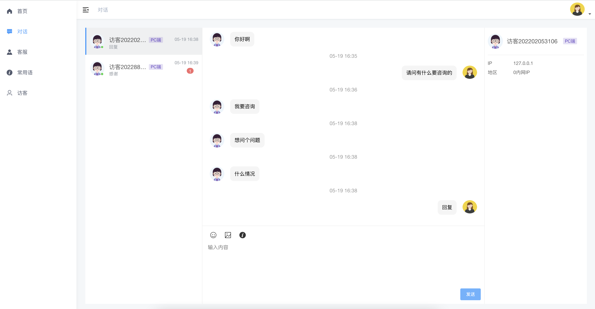

#### 参与贡献

1.  Fork 本仓库
2.  新建 Feat_xxx 分支
3.  提交代码
4.  新建 Pull Request

#### 版权说明
禁止将本项目应用于木马、病毒、色情、赌博、诈骗等违反国家法律法规行业。  
本项目仅供应用于合法的场景或学习参考  
禁止出售基于本项目衍生的版本或者直接出售本项目。

#### 特别鸣谢
thinkphp (https://www.thinkphp.cn)  
phpsocket.io (https://www.workerman.net)  
vue (https://cn.vuejs.org)  
elementui (https://element.eleme.cn/#/zh-CN/component/installation)  
正是基于这些优秀的开源项目，才有本项目的诞生。